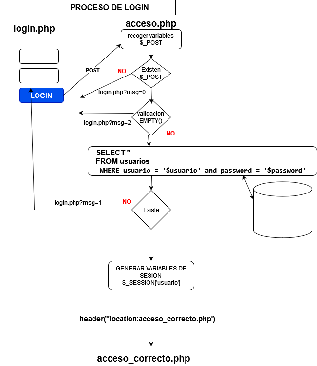

# Accesos a mySQL usando PHP

## 📁01-employees

Ejemplos de conexión a Base de Datos y queries de consulta.

## 📁02-login

Codigo de login sobre una tabla usuarios.

login.php        ->   acceso.php    -> acceso_correcto.php
login.php?mes=x  <- 

### usuario.sql 
fichero sql para genera la tabla 

## conexion.php 
fichero con la conexion a la BASE DE DATOS

## login.php 

## registro_ia.php

Resgistro de usuarios

## registro_ia_ajax.php

registros de usurio con validación AJAX de usuario email. (validate.js, check_user.php)
